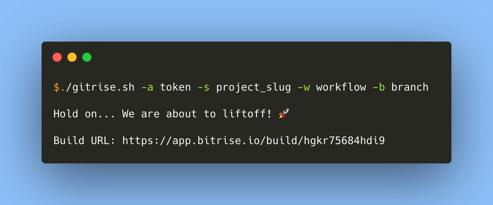

# Gitrise 
[](https://github.com/azohra/gitrise.sh/releases)
[](https://github.com/azohra/gitrise.sh/actions?query=branch%3Adevelop)

A Bitrise trigger in pure `bash`!



## Usage
To use Gitrise, all you need is the `gitrise.sh` script. There are four arguments that you have to pass to the script for a successful run:  
 
 ```gitrise.sh -a token -s project_slug -w workflow [-b branch|-t tag|-c commit]``` 

### Git Checkout Config (commit, tag, branch)
Gitrise supports all the Git Checkout configuraions supported by Bitrise including commit, tag, and branch. In the example above, these options are shown with `[-b branch|-t tag|-c commit]`. For building purposes, however, you should only pass one of these building options as Bitrise will only use one of them in this priority order: commit, tag, branch. Some of the common use cases are given below:

Trigger a build for a specific branch:

```
gitrise.sh -a token -s project_slug -w workflow -b branch
```

Trigger a build for a specific tag:

```
gitrise.sh -a token -s project_slug -w workflow -t tag
```
### Displaying the Build Logs

With Gitrise, you are able to display the Bitrise build logs with two different approaches:

1. You can stream the logs as the build is happening on Bitrise using the `--stream` flag:

 ```gitrise.sh -a token -s project_slug -w workflow [-b branch|-t tag|-c commit] --stream```  
  
2. Fetch and display the logs once the build is finished. This is the default behaviour if the `--stream` flag is not passed.

In both approaches, Gitrise monitors the build status by polling the Bitrise API. This polling frequency directly affects the log streaming rate and, in the second approach, the time it takes to fetch logs after the build is complete. The default value is 30 seconds. You may want to decrease this value for small projects with a total Bitrise workflow duration of 10 minutes or less. However, since we want to avoid overloading the Bitrise APIs, intervals less than 10 seconds are not allowed. Changing the polling interval can be done using the `-p|--poll` option:

 ```
 gitrise.sh -a token -s project_slug -w workflow [-b branch|-t tag|-c commit] --stream -p polling-interval-in-seconds
 ```

The complete Gitrise usage guide can be found below:

```
Usage: gitrise.sh [-d] [-e] [-h] [-T] [-v]  -a token -s project_slug -w workflow [-b branch|-t tag|-c commit] 

  -a, --access-token  <string>    Bitrise access token
  -b, --branch        <string>    Git branch
  -c, --commit        <string>    Git commit hash
  -d, --debug                     Debug mode enabled
  -D, --download      <string>    Download artifacts to specified directory" 
  -e, --env           <string>    List of environment variables in the form of key1:value1,key2:value2
  -h, --help                      Print this help text
  -p, --poll           <string>   Polling interval (in seconds) to check the build status." 
      --stream                    Stream the build logs"
  -s, --slug          <string>    Bitrise project slug
  -T, --test                      Test mode enabled
  -t, --tag           <string>    Git tag
  -v, --version                   App version
  -w, --workflow      <string>    Bitrise workflow
```

## Contributing

Bug reports and suggestions for improvement are always welcome! Pull requests are also accepted!

If you are interested in adding functionality through a pull request, please open a new issue so that we have the chance to discuss it first.

Before opening a PR, please make sure you have gone through the following steps:

 * linted the scripts you have touched using [ShellCheck](https://github.com/koalaman/shellcheck)
 * added tests for your changes

To run the unit tests, use the following command in the project directory
```bash
./tests/test_runner
```

After testing your changes, open a pull request to merge your branch into the **develop** branch.

## License
This software is available as open source under the terms of the MIT License. A copy of this license is included in the file [LICENSE](https://github.com/azohra/gitrise.sh/blob/develop/LICENSE).
